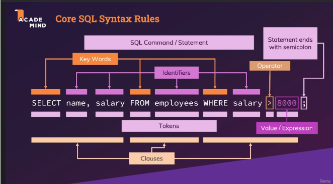

# PostIt - SQL - The Complete Developer's Guide (MySQL, PostgreSQL)

## Section 1 : Introduction

### **3. A Closer Look At SQL & Databases**

[notes](../01.Section1.Introduction/3.A-Closer-Look-At-SQL&Databases/notes.md)

`Add a short resume about the concept and the goal`

1. **Database**: A structured collection of data stored and organized for efficient management and retrieval.
2. **Relational Database**: A type of database that organizes data into tables with defined relationships between them.
3. **Table**: A structure in a database that stores data in rows and columns.
4. **Row**: A single record in a table (also called a **tuple** or **entry**).
5. **Column**: A single field or attribute in a table, defining the type of data stored (e.g., `Name`, `Price`).
6. **Primary Key**: A unique identifier for each record in a table, ensuring data integrity.
7. **Foreign Key**: A field in a table that links to the primary key in another table, creating a relationship.
8. **Relationship**: The logical connection between tables in a database (e.g., one-to-many, many-to-many).
9. **Query**: A request made to a database to retrieve or manipulate data.
10. **Constraint**: A rule enforced on a table to maintain data integrity (e.g., `NOT NULL`, `UNIQUE`).

## **Section 2: SQL Basics Syntax & Features**

### **9. Module Introduction**

[notes](../02.Section2.SQL-Basics-Syntax&Features/09.Module-Introduction/notes.md)

`Add a short resume about the concept and the goal`

1. **SELECT**: A command to retrieve specific data from a database.
2. **FROM**: Specifies the table from which to retrieve the data.
3. **WHERE**: Adds conditions to filter the data retrieved.
4. **ORDER BY**: Sorts the data in ascending or descending order.
5. **LIMIT**: Restricts the number of rows returned in a query.
6. **INSERT**: Adds new data into a table.
7. **UPDATE**: Modifies existing data in a table.
8. **DELETE**: Removes data from a table.
9. **Semicolon (`;`)**: Indicates the end of an SQL statement.
10. **Comment**: A way to document your SQL code using `--` for single-line or `/* */` for multi-line comments.

### **10. Understanding The Core SQL Syntax**

- [notes](../02.Section2.SQL-Basics-Syntax&Features/10.Understanding-The-Core-SQL-Syntax/notes.md)
- [schema](../02.Section2.SQL-Basics-Syntax&Features/10.Understanding-The-Core-SQL-Syntax/pdf/core-sql-syntax-rules.png)

<div style="text-align:center">

</div>

`Add a short resume about the concept and the goal`

1. **SQL**: A language used to interact with relational databases.
2. **SELECT**: Retrieves data from one or more columns in a table.
3. **FROM**: Specifies the table to query data from.
4. **WHERE**: Filters the data based on specified conditions.
5. **ORDER BY**: Sorts the results by a column in ascending (`ASC`) or descending (`DESC`) order.
6. **LIMIT**: Restricts the number of rows returned in the result set.
7. **Wildcard (`*`)**: Represents all columns in a table.

### **11. SQL in Action**

[notes](../02.Section2.SQL-Basics-Syntax&Features/11.SQL-in-Action/notes.md)

`Add a short resume about the concept and the goal`

1. **JOIN**: Combines rows from two or more tables based on a related column.
2. **AVG()**: A function to calculate the average value of a column.
3. **SUM()**: A function to calculate the total value of a column.
4. **GROUP BY**: Groups rows sharing a common value into summary rows.
5. **AS**: Renames a column or table in the query output (aliasing).

### **12. The Core SQL Rules**

[notes](../02.Section2.SQL-Basics-Syntax&Features/12.The-Core-SQL-Rules/notes.md)

`Add a short resume about the concept and the goal`

### **13. Data Definition vs Data Manipulation**

[notes](../02.Section2.SQL-Basics-Syntax&Features/13.Data-DefinitionvsData-Manipulation/notes.md)

`Add a short resume about the concept and the goal`

1. **DDL (Data Definition Language)**: SQL commands used to define and manage the database structure.
2. **DML (Data Manipulation Language)**: SQL commands used to manage the data stored in a database.
3. **CRUD**: An acronym for Create, Read, Update, Delete—core operations in data manipulation.
4. **Constraints**: Rules applied to database objects (e.g., primary key, foreign key).

---

## Section 3: Course Setup - Installing MySQL & PostgreSQL

[notes](../02.Section2.SQL-Basics-Syntax&Features/12.The-Core-SQL-Rules/notes.md)

`Add a short resume about the concept and the goal`

### **14. Introduction**

1. **Database Server**: Software that allows you to store, retrieve, and manage data in a database.
2. **MySQL**: An open-source relational database management system.
3. **PostgreSQL**: A powerful, standards-compliant relational database management system.
4. **MySQL Workbench**: A GUI tool for managing MySQL databases.
5. **pgAdmin**: A GUI tool for managing PostgreSQL databases.
6. **Test Database**: A sample database used to verify that your setup is working correctly.

### 16. What We Need To Install

1. **Database System Server**: The backend service that processes SQL queries and stores data.
2. **Client Software**: Applications that allow users to interact with the database server.
3. **GUI Tool**: A graphical interface for managing databases, such as MySQL Workbench or pgAdmin.
4. **Command-Line Tool**: A text-based interface for executing SQL commands, such as `mysql` or `psql`.

### **22. Starting & Stopping Servers + Uninstalling Database Systems**

[notes](../04.Section3.Course-Setup.Intalling-MYSQL&Postgresql/22.Starting&Stopping-Servers+Uninstalling-Database-Systems/notes.md)

`Add a short resume about the concept and the goal`

1. **Service**: A background application running on your system, like a database server.
2. **systemctl**: A system management tool used in Linux distributions to manage services.
3. **Data Directory**: A folder where a database stores its data files.
4. **Uninstall**: The process of removing a program and its associated files from your system.

### 23. Connecting To Database Servers (MySQL & Postgresql) With Various Clients

[notes](../04.Section3.Course-Setup.Intalling-MYSQL&Postgresql/23.Connecting-To-Database-Servers-MySQL&Postgresql-With-Various-Clients/notes.md)

`Add a short resume about the concept and the goal`

1. **Client**: A tool or application that connects to a database server to run queries or manage data.
2. **Hostname**: The address of the server hosting the database. For local servers, use `localhost`.
3. **Port**: The communication endpoint. Default ports are `3306` (MySQL) and `5432` (PostgreSQL).
4. **pgAdmin**: A graphical interface for managing PostgreSQL.
5. **MySQL Workbench**: A graphical tool for managing MySQL databases.
6. **psql**: The command-line client for PostgreSQL.
7. **mysql**: The command-line client for MySQL.

### **24. Setting Up Visual Studio Code With The SQLTools Extension**

[notes](../04.Section3.Course-Setup.Intalling-MYSQL&Postgresql/24.Setting-Up-Visual-Studio-Code-With-The-SQLTools-Extension/notes.md)

`Add a short resume about the concept and the goal`

1. **SQLTools**: A VS Code extension that enables database management within the editor.
2. **Driver**: A piece of software that enables communication between SQLTools and a specific database type.
3. **Query**: A command or statement used to interact with a database.
4. **Connection Manager**: The SQLTools interface for configuring and managing database connections.

### **25. Configuring VS Code & Exploring SQLTools**

[notes](../04.Section3.Course-Setup.Intalling-MYSQL&Postgresql/25.ConfiguringVSCode&Exploring-SQLTools/notes.md)

`Add a short resume about the concept and the goal`

1. **SQLTools**: A VS Code extension that simplifies database management and querying.
2. **Database Explorer**: A sidebar feature in SQLTools that allows you to navigate database tables and schemas.
3. **IntelliSense**: A feature that provides code suggestions and autocompletion for SQL queries.
4. **Query Results**: The output generated after executing an SQL query.

### **26. More on VS Code & SQLTools**

[notes](../04.Section3.Course-Setup.Intalling-MYSQL&Postgresql/26.More-OnVSCode&SQLTools/notes.md)

`Add a short resume about the concept and the goal`

1. **Auto Open Session Files**: A feature that opens a new `.sql` file automatically when switching database connections.
2. **Query Timeout**: The maximum time allowed for a query to execute before it times out.
3. **IntelliSense**: Autocompletion and syntax suggestions for SQL queries.
4. **User Settings**: Global settings applied to all VS Code projects.
5. **Workspace Settings**: Project-specific settings that override global ones.

---

## Section 4: Data Definitions – Managing Tables & Working with Data Types

### **27. Module Introduction**

[notes](../05.Section4.Data-Definitions–Managing-Tables&Working-with-Data-Types/27.%20Module%20Introduction/notes.md)

#### **Important Keywords & Definitions**

1. **DDL (Data Definition Language)**: SQL commands used to define and modify database structures (e.g., `CREATE`, `ALTER`, `DROP`).
2. **`CREATE TABLE`**: Command to create a new table in a database.
3. **Data Type**: Specifies the kind of data a column can hold (e.g., `INT`, `VARCHAR`, `DATE`).
4. **Constraint**: Rules applied to columns to enforce data integrity (e.g., `PRIMARY KEY`, `NOT NULL`).
5. **`ALTER TABLE`**: Command to modify an existing table’s structure.
6. **`DROP TABLE`**: Command to delete a table and its data from the database.

### **28. Key Terms When Working With Data Definition Statements & Commands**

[notes](../05.Section4.Data-Definitions–Managing-Tables&Working-with-Data-Types/28.Key-Terms-When-Working-With-Data%20Definition-Statements&Commands/notes.md)

`Add a short resume about the concept and the goal`

### **Important Keywords & Definitions Recap**

1. **DDL**: Data Definition Language for managing database structures.
2. **Primary Key**: Unique identifier for each row.
3. **Foreign Key**: Field linking one table to another.
4. **Constraint**: Rules to maintain data integrity.
5. **Index**: Speeds up data retrieval.
6. **Schema**: Defines the structure and organization of a database.

### **29. Introducing The Course Section Example**

[notes](../05.Section4.Data-Definitions–Managing-Tables&Working-with-Data-Types/29.Introducing-The-Course-Section-Example/notes.md)

`Add a short resume about the concept and the goal`

### **30. Introducing Key Data Definition Clauses**

[notes](../05.Section4.Data-Definitions–Managing-Tables&Working-with-Data-Types/30.Introducing-Key-Data-Definition-Clauses/notes.md)

`Add a short resume about the concept and the goal`

### **31. Creating a New Database in PostgreSQL (Using SQLTools with VS Code)**

[notes](../05.Section4.Data-Definitions–Managing-Tables&Working-with-Data-Types/31.Creating-a-new-Database-CREATE-DATABASE/notes.md)

`Add a short resume about the concept and the goal`

#### **Important Keywords & Definitions**

1. **`CREATE TABLE`**: Defines a new table.
2. **`ALTER TABLE`**: Modifies an existing table.
3. **`DROP TABLE`**: Deletes a table and its data.
4. **`TRUNCATE TABLE`**: Removes all rows from a table without deleting its structure.
5. **Constraint**: Rules applied to columns to ensure data integrity (`PRIMARY KEY`, `FOREIGN KEY`, `NOT NULL`, etc.).

### **32. Deleting Databases & `IF NOT EXISTS` in PostgreSQL**

[notes](../05.Section4.Data-Definitions–Managing-Tables&Working-with-Data-Types/32.Deleting-Databases&IF-NOT-EXISTS-in-PostgreSQL/notes.md)

`Add a short resume about the concept and the goal`

### **Summary of Key Commands**

| **Command**                     | **PostgreSQL Support** |
| ------------------------------- | ---------------------- |
| `DROP DATABASE IF EXISTS`       | ✅ Supported           |
| `CREATE DATABASE IF NOT EXISTS` | ❌ Not Supported       |
| `CREATE TABLE IF NOT EXISTS`    | ✅ Supported           |

### **33. The Importance of Data Types (Value Types) in PostgreSQL**

[notes](../05.Section4.Data-Definitions–Managing-Tables&Working-with-Data-Types/33.The-Importance-Of-Data-Types-Value-Types/notes.md)

`Add a short resume about the concept and the goal`

---

## Commonly commands

### View all tables from a DB

```sql
FROM information_schema.tables
SELECT table_name
WHERE table_schema = 'public';
```

### **34. Introducing Key Text Value Types in PostgreSQL**

[notes](../05.Section4.Data-Definitions–Managing-Tables&Working-with-Data-Types/34.Introducing-Key-Text-Value-Types/notes.md)

`Add a short resume about the concept and the goal`

### **Comparison of Text Types**

| **Type**         | **Description**                         | **Max Length** | **Use Case**                      |
| ---------------- | --------------------------------------- | -------------- | --------------------------------- |
| **`CHAR(n)`**    | Fixed-length string, padded with spaces | `n` characters | Fixed-size data (e.g., codes)     |
| **`VARCHAR(n)`** | Variable-length string, up to `n`       | `n` characters | Varying-length data (e.g., names) |
| **`TEXT`**       | Unlimited-length string                 | No limit       | Long text (e.g., articles)        |

## **35. Introducing Numeric Values, Date Types, and More in PostgreSQL**

[notes](../05.Section4.Data-Definitions–Managing-Tables&Working-with-Data-Types/35.Introducing-Numeric-Values-Date-Types&More/notes.md)

`Add a short resume about the concept and the goal`

### **Summary**

- **Numeric Types**: `SMALLINT`, `INTEGER`, `BIGINT`, `DECIMAL`, `REAL`, `DOUBLE PRECISION`
- **Date/Time Types**: `DATE`, `TIME`, `TIMESTAMP`, `TIMESTAMPTZ`, `INTERVAL`
- **Boolean**: `BOOLEAN` for `TRUE` or `FALSE` values.
- Choosing the right data type is essential for **efficiency**, **data integrity**, and **performance**.

## **36. An Overview of Numeric Value Types in PostgreSQL**

[notes](../05.Section4.Data-Definitions–Managing-Tables&Working-with-Data-Types/36.An-Overview-of-Numeric-Value-Types-in-PostgreSQL/notes.md)

`Add a short resume about the concept and the goal`

## **37. How Do You Store Files in PostgreSQL?**

[notes](../05.Section4.Data-Definitions–Managing-Tables&Working-with-Data-Types/37.How-Do-You-Store-Files/notes.md)

`Add a short resume about the concept and the goal`

### **Comparison of Methods**

| **Method**        | **Use Case**                 | **Pros**                       | **Cons**                          |
| ----------------- | ---------------------------- | ------------------------------ | --------------------------------- |
| **`BYTEA`**       | Small files (up to a few MB) | Simple to use, stores in table | Not suitable for large files      |
| **Large Objects** | Large files (>10 MB)         | Efficient for large files      | Requires special LO functions     |
| **File Paths**    | Very large files             | Lightweight, reduces DB size   | Relies on filesystem availability |

### **38. Getting Started With the `CREATE TABLE` Statement & Syntax in PostgreSQL**

[notes](../05.Section4.Data-Definitions–Managing-Tables&Working-with-Data-Types/38.Getting-Started-With-The-CREATE-TABLE-Statement&Syntax/notes.md)

`Add a short resume about the concept and the goal`

### **39. Creating a First Text Column in PostgreSQL**

[notes](../05.Section4.Data-Definitions–Managing-Tables&Working-with-Data-Types/39.Creating-a-First-Text-Column/notes.md)

`Add a short resume about the concept and the goal`

### **Best Practices for Text Columns**

1. **Use `VARCHAR(n)`** for fields with predictable maximum lengths (e.g., names, emails).
2. **Use `TEXT`** for fields where the length is unpredictable (e.g., descriptions, comments).
3. **Avoid `CHAR(n)`** unless you have fixed-length data, as it pads shorter strings with spaces.
4. **Add Constraints** like `NOT NULL` or `UNIQUE` when necessary to ensure data integrity.

## **40. Creating a Numeric Value Column in PostgreSQL**

[notes](../05.Section4.Data-Definitions–Managing-Tables&Working-with-Data-Types/39.Creating-a-First-Text-Column/notes.md)

`Add a short resume about the concept and the goal`

#### **Common Numeric Data Types in PostgreSQL**

| **Data Type**          | **Description**                                  | **Range**                         |
| ---------------------- | ------------------------------------------------ | --------------------------------- |
| **`SMALLINT`**         | Small integer (2 bytes)                          | -32,768 to 32,767                 |
| **`INTEGER` / `INT`**  | Standard integer (4 bytes)                       | -2,147,483,648 to 2,147,483,647   |
| **`BIGINT`**           | Large integer (8 bytes)                          | -9 quintillion to 9 quintillion   |
| **`DECIMAL(p, s)`**    | Exact fixed-point number                         | User-defined precision and scale  |
| **`NUMERIC(p, s)`**    | Same as `DECIMAL`                                | User-defined precision and scale  |
| **`REAL`**             | Single-precision floating-point number (4 bytes) | 6 decimal digits of precision     |
| **`DOUBLE PRECISION`** | Double-precision floating-point number (8 bytes) | 15-17 decimal digits of precision |
| **`SERIAL`**           | Auto-incrementing integer (4 bytes)              | 1 to 2,147,483,647                |
| **`BIGSERIAL`**        | Auto-incrementing large integer (8 bytes)        | 1 to 9,223,372,036,854,775,807    |

#### **Summary**

- Use **`INTEGER`**, **`SMALLINT`**, or **`BIGINT`** for whole numbers.
- Use **`DECIMAL`/`NUMERIC`** for exact decimal values.
- Use **`REAL`** or **`DOUBLE PRECISION`** for approximate floating-point values.
- Add constraints to ensure **data integrity** (e.g., `CHECK (value > 0)`).

### **41. Working with Enums & Finishing Table Creation in PostgreSQL**

[notes](../05.Section4.Data-Definitions–Managing-Tables&Working-with-Data-Types/41.Working-with-Enums&Finishing-Table-Creation/notes.md)

`Add a short resume about the concept and the goal`

#### **Best Practices for Using Enums**

1. **Use Enums for Fixed Sets of Values**:

   - Enums are great for columns with a limited set of predefined values (e.g., statuses, categories).

2. **Consider Future Changes**:

   - If you anticipate frequent changes to the set of allowed values, enums may not be the best choice. Consider using a separate lookup table instead.

3. **Naming Conventions**:

   - Use clear and descriptive names for enum types (e.g., `task_status`, `role_type`).

4. **Combining Constraints**:
   - Combine enums with constraints like `NOT NULL` and `DEFAULT` to enforce data integrity.

#### Summary

- Enums are useful for columns with a fixed set of values.
- Use the CREATE TYPE statement to define an enum.
- Enums help enforce data integrity and simplify schema design.
- Combine enums with constraints like NOT NULL and DEFAULT for more robust tables.

### **42. Inserting Data into the Created Table (`INSERT INTO`) in PostgreSQL**

[notes](../05.Section4.Data-Definitions–Managing-Tables&Working-with-Data-Types/42.Inserting-Data-Into-The-Created-Table-INSERT%20INTO/notes.md)

`Add a short resume about the concept and the goal`

#### **Summary**

- **`INSERT INTO`** is used to add new rows to a table.
- You can insert data into **all columns** or **specific columns**.
- Use **`RETURNING`** to get values from the inserted rows.
- Handle errors related to constraints and data types carefully.

## **43. Inserting & Querying More Data in PostgreSQL**

[notes](../05.Section4.Data-Definitions–Managing-Tables&Working-with-Data-Types/43.Inserting&Querying-More-Data-in-PostgreSQL/notes.md)

`Add a short resume about the concept and the goal`

### **Summary**

- **Insert Data**: Use `INSERT INTO` to add multiple rows to a table.
- **Query Data**: Use `SELECT` with options like `WHERE`, `JOIN`, `ORDER BY`, `AND`, and `OR` to retrieve and filter data.
- **Practice**: Combining `INSERT` and `SELECT` helps solidify your understanding of data manipulation in PostgreSQL.

### **44. Working with Fixed-Point and Floating-Point Numbers in PostgreSQL**

[notes](../05.Section4.Data-Definitions–Managing-Tables&Working-with-Data-Types/44.Working-With-Fixed-Point&Floating-Point-Numbers/notes.md)

`Add a short resume about the concept and the goal`

### **Summary**

- **Fixed-Point Numbers** (`DECIMAL`/`NUMERIC`) provide **exact precision** and are ideal for financial data.
- **Floating-Point Numbers** (`REAL`/`DOUBLE PRECISION`) provide **approximate precision** and are suitable for scientific calculations.
- Choose the appropriate numeric type based on your **precision needs** and **use case**.

### **45. Adding Boolean Value Types in PostgreSQL**

[notes](../05.Section4.Data-Definitions–Managing-Tables&Working-with-Data-Types/45.Adding-Boolean-Value-Types/notes.md)

`Add a short resume about the concept and the goal`

### **46. Creating a New Table with Text & Timestamp Data in PostgreSQL**

[notes](../05.Section4.Data-Definitions–Managing-Tables&Working-with-Data-Types/46.Creating-a-new-Table-with-Text-Timestamp-Data/notes.md)

`In PostgreSQL, the TEXT data type is used for storing variable-length strings, while the TIMESTAMP data type is used to store date and time information. These types are commonly combined in tables for tracking events, logging activity, or storing descriptive data with timestamps.`

Add some example or a comparative array

### **Summary**

- **Text Columns**: Use `TEXT` for variable-length strings and `VARCHAR` for strings with a defined maximum length.
- **Timestamp Columns**: Use `TIMESTAMP` for storing date and time information. Use `DEFAULT CURRENT_TIMESTAMP` to auto-fill with the current time.
- **Tracking Updates**: Combine `CreatedAt` and `UpdatedAt` for tracking row creation and modification times.

### **47. Inserting Data into the New Tables in PostgreSQL**

[notes](../05.Section4.Data-Definitions–Managing-Tables&Working-with-Data-Types/47.Inserting-Data-Into-The-New-Tables/notes.md)

`Add a short resume about the concept and the goal`

### **48. Working with Time Zones in PostgreSQL**

[notes](../05.Section4.Data-Definitions–Managing-Tables&Working-with-Data-Types/48.What-About-Time-Zones/notes.md)

`Add a short resume about the concept and the goal`

#### **Summary**

- **`TIMESTAMP WITH TIME ZONE`** stores date-time values with time zone awareness and converts them to UTC internally.
- Use **`SET TIME ZONE`** to change the session's time zone for displaying times.
- Use **`AT TIME ZONE`** to convert timestamps to different time zones.
- Storing times in **UTC** ensures consistency and avoids ambiguity when working with multiple time zones.

### **49. Introducing Default Column Values in PostgreSQL**

[notes](../05.Section4.Data-Definitions–Managing-Tables&Working-with-Data-Types/49.Introducing-Default-Column-Values/notes.md)

`Add a short resume about the concept and the goal`

### **50. Deleting (Dropping) Tables & Inserting Data with Default Values in PostgreSQL**

[notes](../05.Section4.Data-Definitions–Managing-Tables&Working-with-Data-Types/50.Deleting-Dropping-Tables&Inserting-Data-With-Default-Values/notes.md)

`Add a short resume about the concept and the goal`

#### **Summary**

- **`DROP TABLE`** deletes a table and its data. Use `IF EXISTS` to avoid errors.
- **Default values** simplify data insertion by automatically filling in predefined values.
- Use `DEFAULT` in `INSERT` statements to explicitly apply default values.
- Combine `DROP TABLE` and `CREATE TABLE` for table management during development.

### **51. Updating Tables & Columns in PostgreSQL**

[notes](../05.Section4.Data-Definitions–Managing-Tables&Working-with-Data-Types/51.Updating-Tables&Columns/notes.md)

`Add a short resume about the concept and the goal`

#### **Summary**

- Use **`UPDATE`** to modify existing rows in a table.
- Use **`ALTER TABLE`** to modify the table structure by adding, dropping, renaming, or altering columns.
- Be cautious with updates and structure changes, especially in production databases.

### **52. Dealing with "No Data" (`NULL`) vs "0" in PostgreSQL**

[notes](../05.Section4.Data-Definitions–Managing-Tables&Working-with-Data-Types/52.Dealing-With-No-Data-NULLvs-0/notes.md)

`Add a short resume about the concept and the goal`
