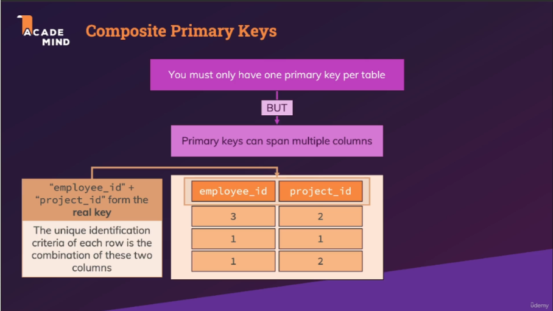
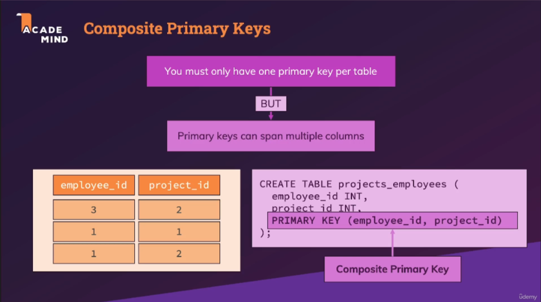
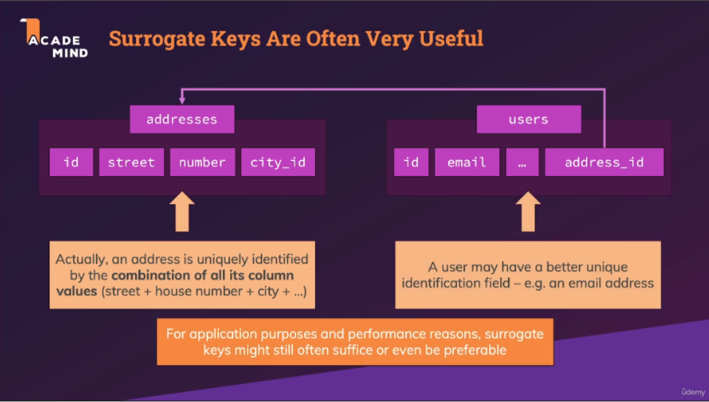

# Section 7 : More on Primary & Foreign keys

## 130. Introducing Composite Primary Keys

- [udemy](https://www.udemy.com/course/sql-the-complete-developers-guide-mysql-postgresql/learn/lecture/28918730#overview)
- [udemy - schema - composite-primary-key-1](pdf/composite-primary-key-1.png)
- [udemy - schema - composite-primary-key-2](pdf/composite-primary-key-2.png)
- [udemy - schema - composite-primary-key-3](pdf/composite-primary-key-3.png)

### How built a composite primary key ?

The composite primary key is made from the combination of two columns or more

