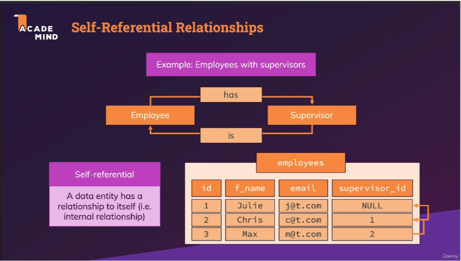

# Section 7 : More on Primary & Foreign keys

## 134. Self-Referencing Relationships (Self-Referential Relationships)

- [udemy](https://www.udemy.com/course/sql-the-complete-developers-guide-mysql-postgresql/learn/lecture/28918760#overview)
- [udemy - self-referential-relationships](pdf/self-referential-relationships.png)

<div style="text-align:center">

</div>

```sql

```
