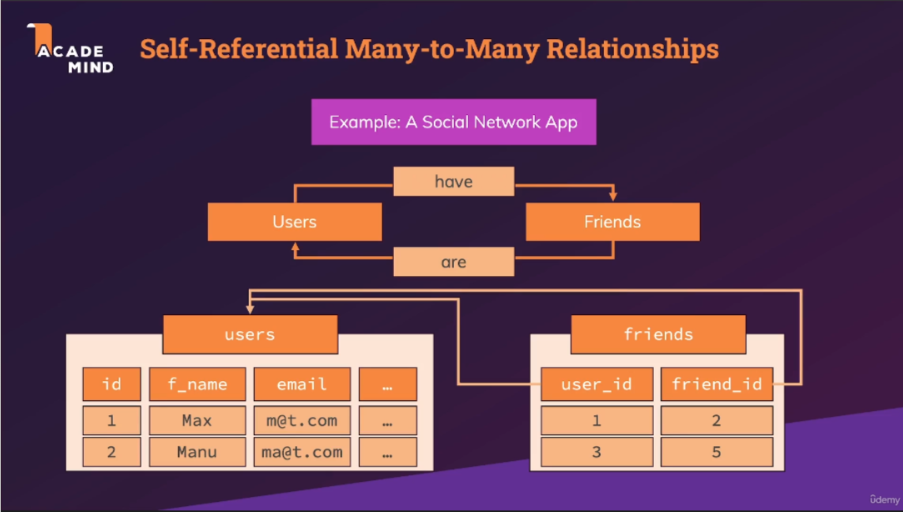

# Section 7 : More on Primary & Foreign keys

## 135. Self-Referencing Many To Many Relationships

- [udemy](https://www.udemy.com/course/sql-the-complete-developers-guide-mysql-postgresql/learn/lecture/28918764#overview)
- [udemy - schema - self-referencing-many-to-many-relationships](pdf/self-referencing-many-to-many-relationships.png)

### examples

