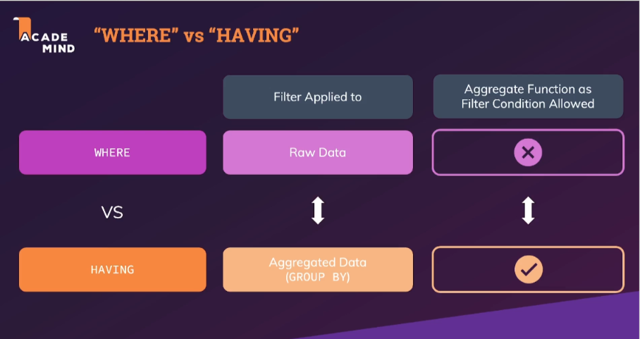

# Section 8 : Grouping & Aggregate Functions

## 146. Understanding WHERE vs HAVING

- [udemy](https://www.udemy.com/course/sql-the-complete-developers-guide-mysql-postgresql/learn/lecture/29287582#overview)
- [udemy - schema - where vs having](img/whereVshaving.png)

