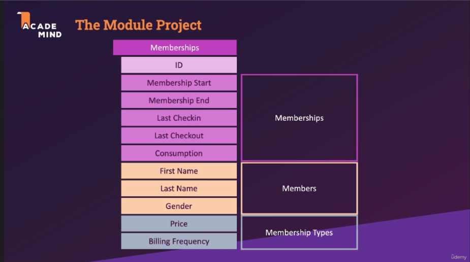

# Section 9: Built-in Query Functions & Operators

## **Roadmap for Section 9: Built-in Query Functions & Operators**

---

#### **Day 1: Wednesday**

**Goal**: Introduction and basic understanding of functions.

- **Tasks**:
  - 🟢 Watch videos:
    - 151. Module Introduction (2 min)
    - 152. The Module Project (5 min)
  - 🟢 Practice:
    - Review the schema of the **Module Project** and try creating the `Members`, `Membership Types`, and `Memberships` tables based on the provided structure.

---

#### **Day 2: Thursday**

**Goal**: Explore string and mathematical functions.

- **Tasks**:
  - 🟢 Watch videos:
    - 153. Working with Mathematical Functions & Arithmetic Operators (14 min)
    - 154. Understanding String Functions with SELECT (7 min)
    - 155. Using String Functions with INSERT (9 min)
  - 🟢 Practice:
    - Use mathematical functions to calculate totals, discounts, or averages.
    - Use string functions (`UPPER`, `LOWER`, `CONCAT`) on `Members` or `Membership Types`.

---

#### **Day 3: Friday**

**Goal**: Understand and apply date/time functions.

- **Tasks**:
  - 🟢 Watch videos:
    - 156. Understanding Date / Time Functions (5 min)
    - 157. Working with Weekdays (8 min)
    - 158. Calculating INTERVALS (10 min)
    - 159. Adding INTERVALS to Dates (8 min)
  - 🟢 Practice:
    - Work on the `Membership Start` and `Membership End` dates:
      - Calculate the duration of memberships using date differences.
      - Add intervals to extend membership periods.

---

#### **Day 4: Sunday**

**Goal**: Dive deeper into filtering and subqueries.

- **Tasks**:
  - 🟢 Watch videos:
    - 160. Understanding LIKE & Pattern Matching (10 min)
    - 161. Understanding EXISTS (6 min)
    - 162. Working with Subquery Expressions and EXISTS (4 min)
    - 163. Working with Subquery Expressions and IN (8 min)
  - 🟢 Practice:
    - Write queries using `LIKE` to find members by patterns in names.
    - Use `EXISTS` and subqueries to filter data:
      - E.g., Find members who have checked in more than 5 times.

---

#### **Day 5: Next Week**

**Goal**: Complete and finalize the section.

- **Tasks**:
  - 🟢 Watch videos:
    - 164. Introducing Conditional Expressions (7 min)
    - 165. Challenge Solution (7 min)
    - 166. Database (SQL) vs Application Level (3 min)
  - 🟢 Practice:
    - Use conditional expressions like `CASE` to label membership types (e.g., "Gold", "Silver").
    - Compare SQL queries and calculations with potential application-side processing.

---

#### **General Notes**

1. ⏱ **Pace Yourself**: Watch videos in chunks and prioritize applying concepts immediately in SQL.
2. 📚 **Practice Regularly**: Ensure each day ends with a mix of theory and practice.
3. ❓ **Ask Questions**: Share any doubts after practicing each set of queries.
4. 💾 **Save Work**: Continuously document your SQL scripts to review later.

Let me know if you need further adjustments or additional details for any day!
