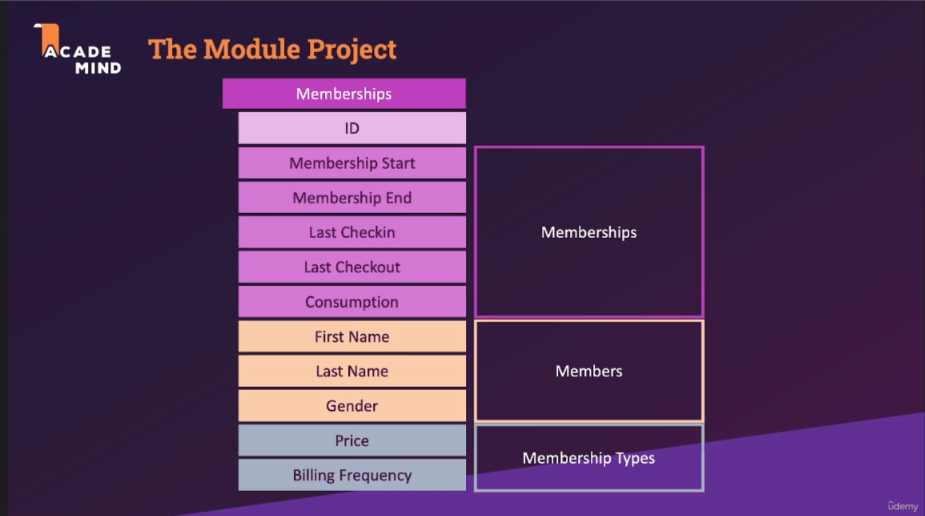

# Section 9: Built-in Query Functions & Operators

## 152. The Module Project

- [udemy](https://www.udemy.com/course/sql-the-complete-developers-guide-mysql-postgresql/learn/lecture/29327476#overview)

- introduce the project module

